# Detecting Moving Objects in DAS Recordings

## Authors:
[Krzysztof Skrobała](https://github.com/shhhQuiettt) 156039<br>
[Wojciech Bogacz](https://github.com/wojbog) 156034

## Introduction
In this project, we analyzed Distributed Acoustic Sensing (DAS) data captured as a 2D numpy matrix, representing strain rates along a fiber optic cable installed on Jana Pawła II street. The data reflects the vibrations caused by passing trams, trucks, and cars. Using image processing and signal analysis techniques, we identified vehicle, tracked their movement, and estimated their velocities, providing valuable insights into traffic patterns on this busy street.

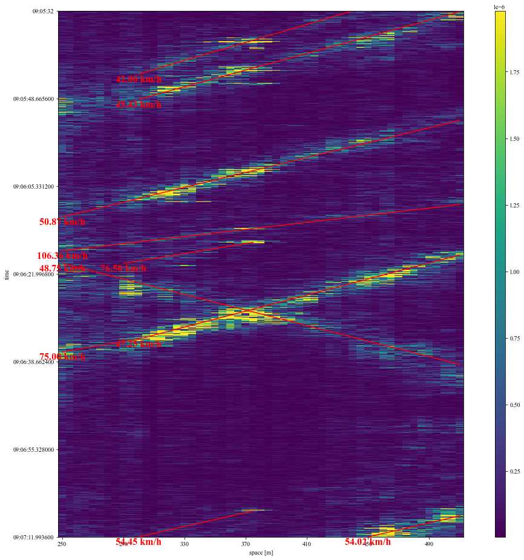

The task is very difficult, therefore we tested 2 approches. None of these is the best, however, some scenarios are better in one case and some in other.

## On the form of the report

First we will introduce the data and methods on a single example. Then we will present the results on the whole dataset.

## Example data

Example data file:

The x-axis represent the __spatial position__ on the cable, while the y-axis represents a __given timestamp__. The color intensity represents the __strain rate__ at a given point in time and space. The data is very noisy and contains multiple moving objects, which we aim to detect and track.

Note that the data shape is `python data.shape` and the display streches the image horizontaly


## Preprocessing

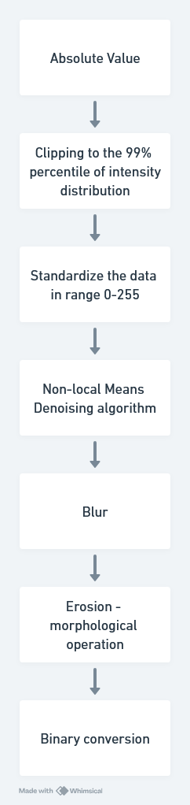


```python

example_filename = "090332.npy"

img = load_from_file(example_filename).to_numpy()
```

To reduce noise and magnify the data we tried many methods in various combinations. 
The most fulfilling approach consists of the following steps:


1. **Absolute value** - The values can be negative, but we are interested only in the magnitude of the signal, so we can take the absolute value


```python
img = np.abs(img)
```

2. **Clip to the 99% percentile of intensity distribution** - As we can see from the plot, data contains outliers, while most of the data lies in a one region


```python
plt.title("Data distribution before removing outliers")
```

```
## Text(0.5, 1.0, 'Data distribution before removing outliers')
```

```python
plt.hist(img.flatten(), bins=100)
```

```
## (array([2.82239e+05, 2.82960e+04, 8.13700e+03, 3.11000e+03, 1.34600e+03,
##        6.73000e+02, 3.32000e+02, 1.82000e+02, 1.00000e+02, 8.60000e+01,
##        6.60000e+01, 5.40000e+01, 3.90000e+01, 3.60000e+01, 2.60000e+01,
##        2.70000e+01, 3.40000e+01, 2.00000e+01, 5.00000e+00, 1.40000e+01,
##        1.60000e+01, 1.90000e+01, 8.00000e+00, 8.00000e+00, 4.00000e+00,
##        6.00000e+00, 1.20000e+01, 6.00000e+00, 1.50000e+01, 4.00000e+00,
##        8.00000e+00, 6.00000e+00, 7.00000e+00, 4.00000e+00, 3.00000e+00,
##        3.00000e+00, 5.00000e+00, 1.00000e+00, 3.00000e+00, 5.00000e+00,
##        1.00000e+00, 1.00000e+00, 3.00000e+00, 1.00000e+00, 1.00000e+00,
##        1.00000e+00, 2.00000e+00, 6.00000e+00, 1.00000e+00, 2.00000e+00,
##        0.00000e+00, 1.00000e+00, 1.00000e+00, 1.00000e+00, 1.00000e+00,
##        1.00000e+00, 0.00000e+00, 0.00000e+00, 0.00000e+00, 0.00000e+00,
##        0.00000e+00, 2.00000e+00, 0.00000e+00, 1.00000e+00, 0.00000e+00,
##        0.00000e+00, 1.00000e+00, 0.00000e+00, 0.00000e+00, 0.00000e+00,
##        1.00000e+00, 0.00000e+00, 1.00000e+00, 1.00000e+00, 0.00000e+00,
##        1.00000e+00, 0.00000e+00, 0.00000e+00, 1.00000e+00, 0.00000e+00,
##        0.00000e+00, 0.00000e+00, 0.00000e+00, 1.00000e+00, 0.00000e+00,
##        0.00000e+00, 0.00000e+00, 0.00000e+00, 0.00000e+00, 0.00000e+00,
##        0.00000e+00, 0.00000e+00, 0.00000e+00, 0.00000e+00, 0.00000e+00,
##        0.00000e+00, 0.00000e+00, 0.00000e+00, 0.00000e+00, 1.00000e+00]), array([0.00000000e+00, 3.22215556e-07, 6.44431111e-07, 9.66646667e-07,
##        1.28886222e-06, 1.61107778e-06, 1.93329333e-06, 2.25550889e-06,
##        2.57772444e-06, 2.89994000e-06, 3.22215556e-06, 3.54437111e-06,
##        3.86658667e-06, 4.18880245e-06, 4.51101778e-06, 4.83323311e-06,
##        5.15544889e-06, 5.47766467e-06, 5.79988000e-06, 6.12209533e-06,
##        6.44431111e-06, 6.76652689e-06, 7.08874222e-06, 7.41095755e-06,
##        7.73317333e-06, 8.05538912e-06, 8.37760490e-06, 8.69981977e-06,
##        9.02203556e-06, 9.34425134e-06, 9.66646621e-06, 9.98868200e-06,
##        1.03108978e-05, 1.06331136e-05, 1.09553293e-05, 1.12775442e-05,
##        1.15997600e-05, 1.19219758e-05, 1.22441907e-05, 1.25664064e-05,
##        1.28886222e-05, 1.32108380e-05, 1.35330538e-05, 1.38552687e-05,
##        1.41774844e-05, 1.44997002e-05, 1.48219151e-05, 1.51441309e-05,
##        1.54663467e-05, 1.57885625e-05, 1.61107782e-05, 1.64329940e-05,
##        1.67552098e-05, 1.70774238e-05, 1.73996395e-05, 1.77218553e-05,
##        1.80440711e-05, 1.83662869e-05, 1.86885027e-05, 1.90107185e-05,
##        1.93329324e-05, 1.96551482e-05, 1.99773640e-05, 2.02995798e-05,
##        2.06217956e-05, 2.09440113e-05, 2.12662271e-05, 2.15884429e-05,
##        2.19106587e-05, 2.22328727e-05, 2.25550884e-05, 2.28773042e-05,
##        2.31995200e-05, 2.35217358e-05, 2.38439516e-05, 2.41661673e-05,
##        2.44883813e-05, 2.48105971e-05, 2.51328129e-05, 2.54550287e-05,
##        2.57772444e-05, 2.60994602e-05, 2.64216760e-05, 2.67438918e-05,
##        2.70661076e-05, 2.73883215e-05, 2.77105373e-05, 2.80327531e-05,
##        2.83549689e-05, 2.86771847e-05, 2.89994005e-05, 2.93216162e-05,
##        2.96438302e-05, 2.99660460e-05, 3.02882618e-05, 3.06104776e-05,
##        3.09326933e-05, 3.12549091e-05, 3.15771249e-05, 3.18993407e-05,
##        3.22215565e-05]), <BarContainer object of 100 artists>)
```

```python
plt.show()
```

<div class="figure">

<p class="caption">plot of chunk unnamed-chunk-4</p>
</div>


```python
high = np.percentile(img, 99)
img = np.minimum(img, high)

plt.title("Data distribution after removing outliers")
```

```
## Text(0.5, 1.0, 'Data distribution after removing outliers')
```

```python
plt.hist(img.flatten(), bins=100)
```

```
## (array([30326., 24672., 23410., 22026., 20390., 18933., 16873., 15183.,
##        15962., 11951., 10449.,  9249.,  8314.,  7515.,  6831.,  6167.,
##         6399.,  4611.,  4223.,  3768.,  3408.,  3182.,  2978.,  2619.,
##         2342.,  2728.,  2022.,  1914.,  1757.,  1609.,  1532.,  1401.,
##         1268.,  1400.,  1215.,  1138.,  1029.,   969.,   901.,   906.,
##          798.,   972.,   728.,   741.,   677.,   575.,   632.,   567.,
##          522.,   521.,   658.,   493.,   467.,   445.,   415.,   431.,
##          370.,   378.,   451.,   359.,   351.,   331.,   305.,   306.,
##          281.,   244.,   345.,   237.,   215.,   231.,   210.,   206.,
##          198.,   181.,   188.,   217.,   161.,   174.,   145.,   181.,
##          141.,   155.,   133.,   169.,   110.,   130.,   128.,   119.,
##          116.,   127.,   119.,   111.,    93.,    93.,    76.,   103.,
##           70.,    94.,   102.,  3334.]), array([0.00000000e+00, 1.28344766e-08, 2.56689532e-08, 3.85034298e-08,
##        5.13379064e-08, 6.41723830e-08, 7.70068596e-08, 8.98413361e-08,
##        1.02675813e-07, 1.15510289e-07, 1.28344766e-07, 1.41179243e-07,
##        1.54013719e-07, 1.66848196e-07, 1.79682672e-07, 1.92517149e-07,
##        2.05351625e-07, 2.18186102e-07, 2.31020579e-07, 2.43855055e-07,
##        2.56689532e-07, 2.69524008e-07, 2.82358485e-07, 2.95192962e-07,
##        3.08027438e-07, 3.20861915e-07, 3.33696391e-07, 3.46530868e-07,
##        3.59365345e-07, 3.72199821e-07, 3.85034298e-07, 3.97868774e-07,
##        4.10703251e-07, 4.23537728e-07, 4.36372204e-07, 4.49206681e-07,
##        4.62041157e-07, 4.74875634e-07, 4.87710111e-07, 5.00544616e-07,
##        5.13379064e-07, 5.26213512e-07, 5.39048017e-07, 5.51882522e-07,
##        5.64716970e-07, 5.77551418e-07, 5.90385923e-07, 6.03220428e-07,
##        6.16054876e-07, 6.28889325e-07, 6.41723830e-07, 6.54558335e-07,
##        6.67392783e-07, 6.80227231e-07, 6.93061736e-07, 7.05896241e-07,
##        7.18730689e-07, 7.31565137e-07, 7.44399642e-07, 7.57234147e-07,
##        7.70068596e-07, 7.82903044e-07, 7.95737549e-07, 8.08572054e-07,
##        8.21406502e-07, 8.34240950e-07, 8.47075455e-07, 8.59909960e-07,
##        8.72744408e-07, 8.85578856e-07, 8.98413361e-07, 9.11247866e-07,
##        9.24082315e-07, 9.36916763e-07, 9.49751268e-07, 9.62585773e-07,
##        9.75420221e-07, 9.88254669e-07, 1.00108923e-06, 1.01392368e-06,
##        1.02675813e-06, 1.03959258e-06, 1.05242702e-06, 1.06526159e-06,
##        1.07809603e-06, 1.09093048e-06, 1.10376504e-06, 1.11659949e-06,
##        1.12943394e-06, 1.14226839e-06, 1.15510284e-06, 1.16793740e-06,
##        1.18077185e-06, 1.19360629e-06, 1.20644086e-06, 1.21927530e-06,
##        1.23210975e-06, 1.24494420e-06, 1.25777865e-06, 1.27061321e-06,
##        1.28344766e-06]), <BarContainer object of 100 artists>)
```

```python
plt.show()
```

<div class="figure">
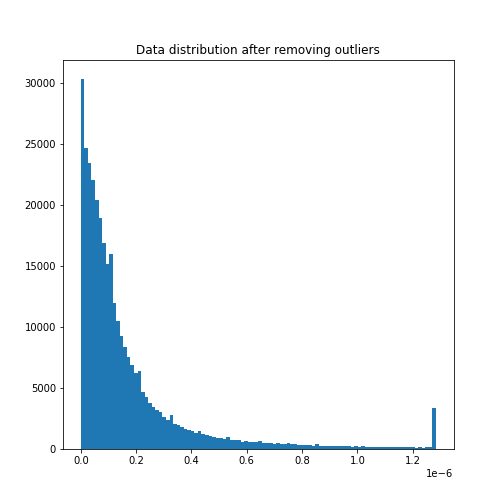
<p class="caption">plot of chunk unnamed-chunk-5</p>
</div>

3. **Standardize the data in range 0-255** - To normalize the data for consistent comparison and processing.

```python
img = np.around(255 * (img - np.min(img)) / (np.max(img) - np.min(img))).astype(
    np.uint8
)
plot_numpy(img, title="Standarized data")
```

<div class="figure">

<p class="caption">plot of chunk unnamed-chunk-6</p>
</div>

4. **Non-local Means Denoising algorithm** - We implement fastNlMeansDenoising with agressive parameters to reduce noise 


```python
img = cv2.fastNlMeansDenoising(img, templateWindowSize=7, searchWindowSize=21, h=14)
plot_numpy(img, title="Non-local Means Denoising")
```

<div class="figure">
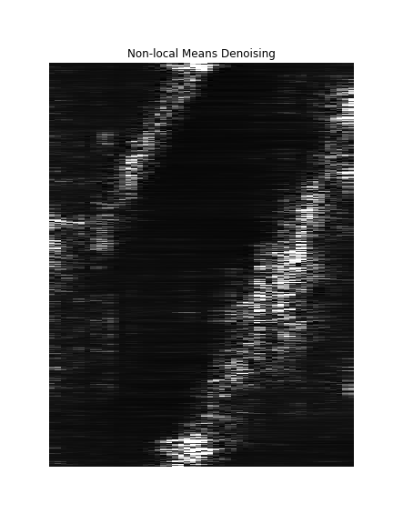
<p class="caption">plot of chunk unnamed-chunk-7</p>
</div>

5. **blur** - We blur the image with a kernel with the greater vertical size, as the data is very narrow in the horizontal dimension.

```python
img = cv2.blur(img, (3, 41))
plot_numpy(img, title="Blurred")
```

<div class="figure">

<p class="caption">plot of chunk unnamed-chunk-8</p>
</div>

6. **Erosion - morphological operation** - As various signals tend to be close to each other, and we don't need much of a aconnectivity as well as edges details, we perform an erosion operation.


```python
img = cv2.morphologyEx(
    img,
    cv2.MORPH_ERODE,
    cv2.getStructuringElement(cv2.MORPH_RECT, (3, 9)),
    iterations=1,
)
plot_numpy(img, title="Erosion")
```

<div class="figure">
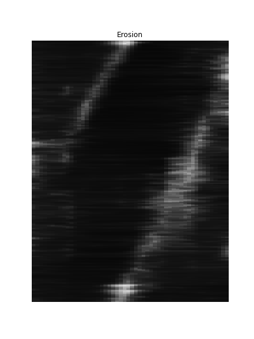
<p class="caption">plot of chunk unnamed-chunk-9</p>
</div>

10. **Binary conversion** - Now we can perform thresholding segmentation to get a binary image.

```python
_, img = cv2.threshold(img, 0, 255, cv2.THRESH_BINARY + cv2.THRESH_OTSU)
plot_numpy(img, title="Binary conversion")
```

<div class="figure">
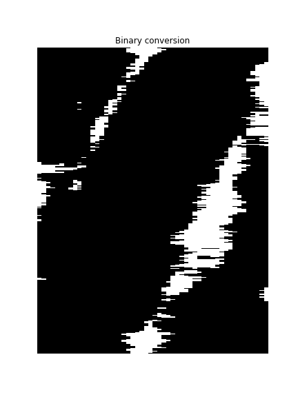
<p class="caption">plot of chunk unnamed-chunk-10</p>
</div>

## Main idea
The main idea behind the two approaches is to detect lines in the data, assuming contant speed of the vehicles

Then, the speed can be calculated from the formula:


```python
def velocity_from_slope(slope: float) -> float:
    return round(abs(1 / slope) * DX / DT, 2)
```

The slope is inverted, because we use the x-axis as the spatial dimension and the y-axis as the time dimension. The velocity is calculated in meters per second.


## FIRST APPROACH

The idea of our first approach was to cluster the values from the different data sources. Then we would apply linear regression within the clusters, on the (x,y) cooridinates of non-zero values. The slope of the regression line would give us the velocity of the vehicle.

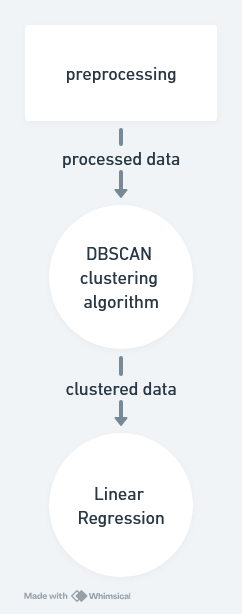

### 1. Clustering
Because of the nature of the data and the fact that we  want to cluster datapoints by density rather than closeness (as in for example `KMeans`) we chose the `DBSCAN` algorithm. It does not require specifying the number of clusters in advance, making it a versatile choice for exploratory data analysis.

_DBSCAN (Density-Based Spatial Clustering of Applications with Noise) is a clustering algorithm that groups together points that are closely packed together, marking as outliers points that lie alone in low-density regions. It requires two parameters: **eps** (the maximum distance between two points to be considered neighbors) and **min_samples** (the minimum number of points required to form a dense region). DBSCAN is particularly effective for <u>discovering clusters of arbitrary shape</u> and handling noise in the data._


```python
X = np.nonzero(img)
X = np.vstack(X).T

scaler = MinMaxScaler()
X_scaled = scaler.fit_transform(X)

clustering = DBSCAN(eps=0.08, min_samples=300).fit(X_scaled)

no_of_clusters = int(np.max(clustering.labels_) + 1)
```

The algorithm detected `python no_of_clusters` clusters in this exemplary data.


```python
colors = generate_colors(no_of_clusters)

colored_clusters = cv2.cvtColor(img, cv2.COLOR_GRAY2RGB)
for cluster_id in range(no_of_clusters):
    # Indices of the points in the cluster
    idx = X[clustering.labels_ == cluster_id, :]

    colored_clusters[idx.T[0], idx.T[1], :] = colors[cluster_id]

plot_numpy(colored_clusters, title="Clustered data")
```

<div class="figure">
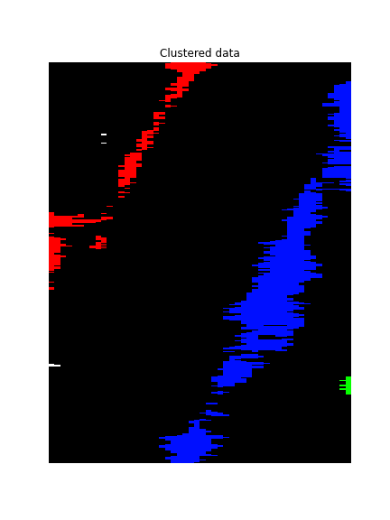
<p class="caption">plot of chunk unnamed-chunk-13</p>
</div>

### 2. Linear Regression
Once we have separated clusters, we can apply _linear regression_ to each of them to estimate the velocity of the moving object.

As some clusters are separated noise, we discard these with R2 < `python 0.5`.


```python
lines = []
velocities = []
for cluster_id in range(no_of_clusters):
    idx = X[clustering.labels_ == cluster_id, :]
    x_coords = idx[:, 1].reshape(-1, 1)
    y_coords = idx[:, 0]

    model = LinearRegression()
    model.fit(x_coords, y_coords)

    slope = model.coef_[0]
    intercept = model.intercept_

    x_start = np.min(x_coords)
    x_end = np.max(x_coords)

    r2 = model.score(x_coords, y_coords)
    print(f"R2: {r2}")

    # Discarding objects with R2 < 0.6
    if r2 < 0.5:
        print(f"Discarding object with R2 < 0.5 ({r2})")
        continue

    velocity = velocity_from_slope(slope)
    print(f"Detected velocity: {velocity} m/s ({''})")
    velocities.append(velocity)

    lines.append((slope, intercept, x_start, x_end))
```

```
## LinearRegression()
## R2: 0.92240659229734
## Detected velocity: 27.13 m/s ()
## LinearRegression()
## R2: 0.8707396109109362
## Detected velocity: 18.26 m/s ()
## LinearRegression()
## R2: 0.0029409018431784117
## Discarding object with R2 < 0.5 (0.0029409018431784117)
```

```python
plot_numpy_with_lines(img, lines, title="Detected velocities")
```

<div class="figure">
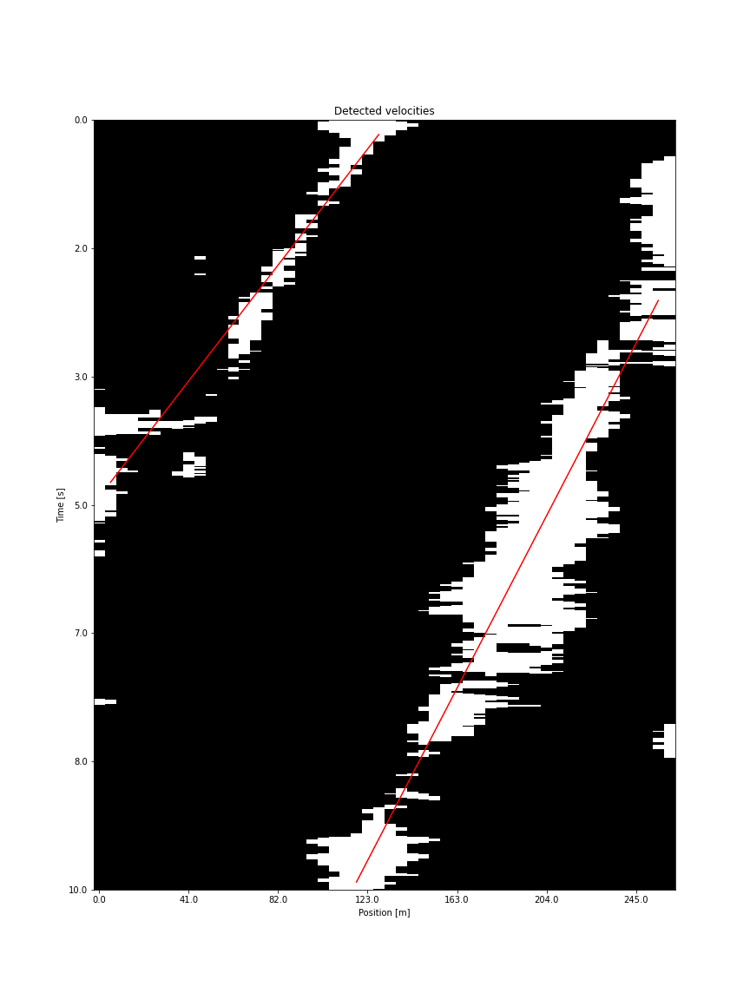
<p class="caption">plot of chunk unnamed-chunk-14</p>
</div>

## SECOND APPROACH
In the second method, we approached the issue from a different angle. First, we generated lines using Houghline and then, we clusterd them.

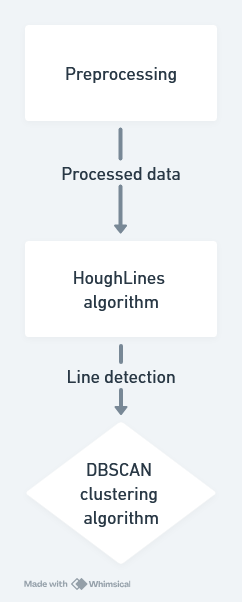

### 1. Hough Lines 

**The Hough Line Transform** is a feature extraction technique used in image analysis and computer vision to detect straight lines in an image. It works by transforming points in the image space to the parameter space, where each point in the image space corresponds to a sinusoidal curve in the parameter space. Lines in the image space are identified by finding intersections of these curves in the parameter space. This method is robust to noise and can detect lines even if they are broken or partially obscured. It is commonly used in applications like lane detection in autonomous driving and shape analysis.

To cluster lines we used the same algorithm like in the first method - **DBSCAN**.

### Implementation


Because our data is very narrow (```python w```) and the lines are visible on the streched image, it makes sense to resize the date, so the `HoughLines` algorithm has more freedom in term of slope selection

```python
aspect_ratio = 12 / 16
h, w = img.shape

new_w = int(aspect_ratio * h)

img = cv2.resize(img, (new_w, h), interpolation=cv2.INTER_NEAREST)

plot_numpy(img)
```

<div class="figure">
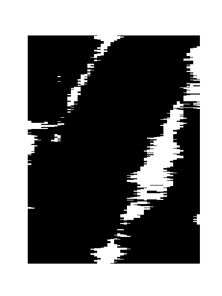
<p class="caption">plot of chunk unnamed-chunk-16</p>
</div>

Now we can apply HoughLines algoritm, which will detect many lines going through the dense regions

```python

img_before = img.copy()

lines = cv2.HoughLinesP(
    img,  # Input edge image
    1,  # Distance resolution in pixels
    np.pi / 180,  # Angle resolution in radians
    threshold=500,  # Min number of votes for valid line
    minLineLength=1500,  # Min allowed length of line
    maxLineGap=400,  # Max allowed gap between line for joining them
)

```
Because some of the lines may be perfectly vertical, and we are interested in the slopes which for them is an infinity we erase them


```python
valid_lines = lines[~(lines[:, :, 0] == lines[:, :, 2]), :]
```

Now we can plot the lines

```python
img_lines = cv2.cvtColor(img, cv2.COLOR_GRAY2RGB)
color_palette = generate_colors(len(valid_lines))
for i in range(len(valid_lines)):
    _ = cv2.line(
        img_lines,
        (valid_lines[i, 0], valid_lines[i, 1]),
        (valid_lines[i, 2], valid_lines[i, 3]),
        [int(c) for c in color_palette[i]],
        1,
        cv2.LINE_AA,
    )
plot_numpy(img_lines)
```

<div class="figure">
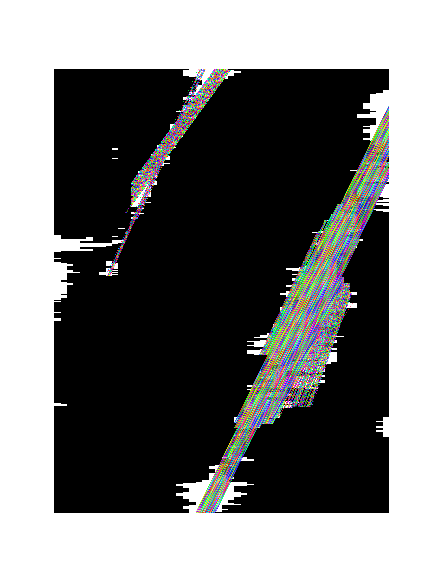
<p class="caption">plot of chunk unnamed-chunk-19</p>
</div>

### 2. Clustering

We now have to separate the line clusters and aggregate them.

We tried using (slope, intercept) and (center_x, center_y) combinations


```python
valid_lines_directional = np.apply_along_axis(
    lambda x: np.array([*get_slope_and_intercept(*x)]), axis=1, arr=valid_lines
)

valid_lines_centers = np.apply_along_axis(
    lambda x: np.array([(x[0] + x[2]) / 2, (x[1] + x[3]) / 2]),
    axis=1,
    arr=valid_lines,
)
```

Normalizing the data

```python
scaler = MinMaxScaler()
X_scaled = scaler.fit_transform(valid_lines_centers)

clustering = DBSCAN(eps=0.15, min_samples=16).fit(X_scaled)


no_of_clusters = np.max(clustering.labels_) + 1
```
The `DBSCAN` algorithm has in-built outliers detection, so we ommit lines marked as cluster `-1` (`python sklearn` implementation)


```python
img_clusters = cv2.cvtColor(img_before, cv2.COLOR_GRAY2RGB)
color_palette = generate_colors(no_of_clusters)
line_colors = np.apply_along_axis(lambda x: color_palette[x],  0, clustering.labels_)
line_colors[ clustering.labels_ == -1 ] = [0,0,255]

for i in range(len(valid_lines)):
    _ = cv2.line(
        img_clusters,
        (valid_lines[i, 0], valid_lines[i, 1]),
        (valid_lines[i, 2], valid_lines[i, 3]),
        [int(c) for c in line_colors[i]],
        1,
        cv2.LINE_AA,
    )

plt.scatter(X_scaled[:, 0], X_scaled[:, 1], c=clustering.labels_)
```

```
## <matplotlib.collections.PathCollection object at 0x74eb26125550>
```

```python
plt.show()
```

<div class="figure">
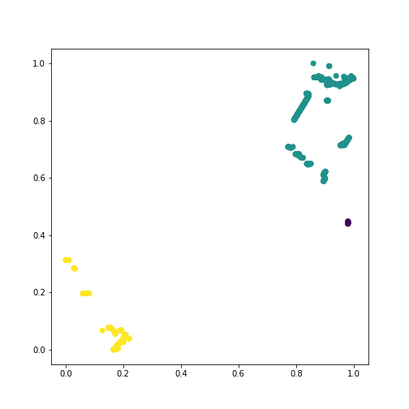
<p class="caption">plot of chunk unnamed-chunk-22</p>
</div>

```python
plot_numpy(img_clusters)
```

<div class="figure">
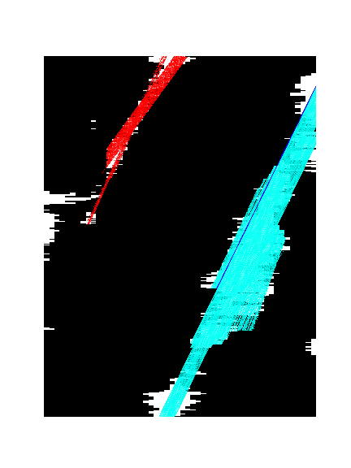
<p class="caption">plot of chunk unnamed-chunk-22</p>
</div>

```python
average_lines = []
velocities = []
for cluster_id in range(no_of_clusters):
    average_line = np.mean(valid_lines_directional[clustering.labels_ == cluster_id], axis=0)
    x_min = 0
    x_max = new_w
    average_lines.append([*average_line, x_min, x_max])

    slope = average_line[0]
    velocities.append(velocity_from_slope(slope))

img_average_lines = cv2.cvtColor(img_before, cv2.COLOR_GRAY2RGB)

plot_numpy_with_lines(img_average_lines, average_lines)
```

<div class="figure">
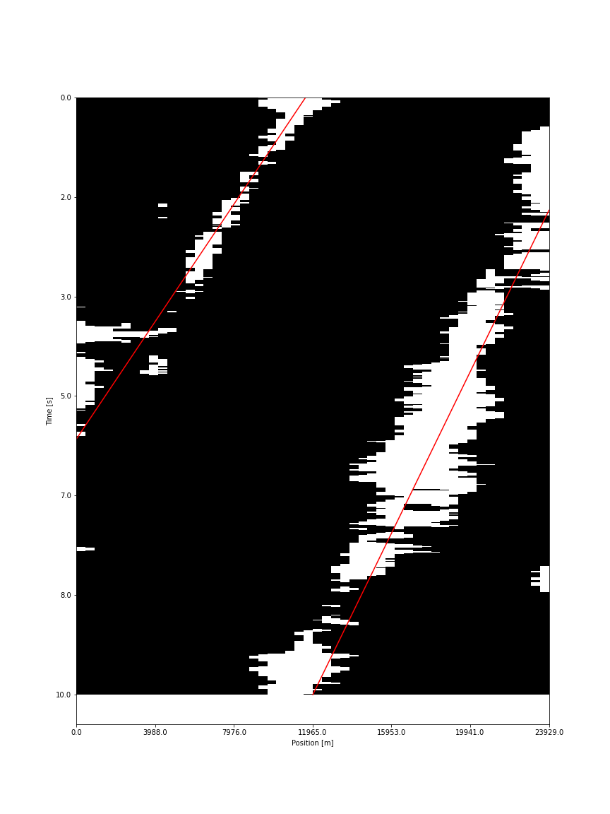
<p class="caption">plot of chunk unnamed-chunk-23</p>
</div>


## Results on the whole dataset


```python
import hough_pipeline
import regression_pipeline
from image_processing import preprocess, initial_preprocess
from data import load_all_files

i = 0
for file in load_all_files():
    if i == 3:
        break
    i+=1
    original = initial_preprocess(file.to_numpy())
    
    img = preprocess(file.to_numpy())
    plot_numpy(original, title="original")
    hough_pipeline.detect_velocities(img, original)
    regression_pipeline.detect_velocities(img,  original)
```

```
## <class 'numpy.ndarray'>
## Detected velocity: 164.67 m/s)
## Detected velocity: 30.34 m/s)
## Detected velocity: 44.48 m/s)
## <class 'numpy.ndarray'>
## Detected velocity: 27.13 m/s)
## Detected velocity: 18.26 m/s)
## <class 'numpy.ndarray'>
## Detected velocity: 26.74 m/s)
```

<div class="figure">
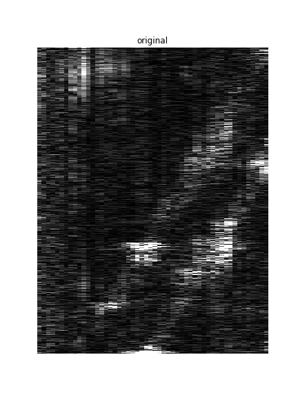
<p class="caption">plot of chunk unnamed-chunk-24</p>
</div><div class="figure">
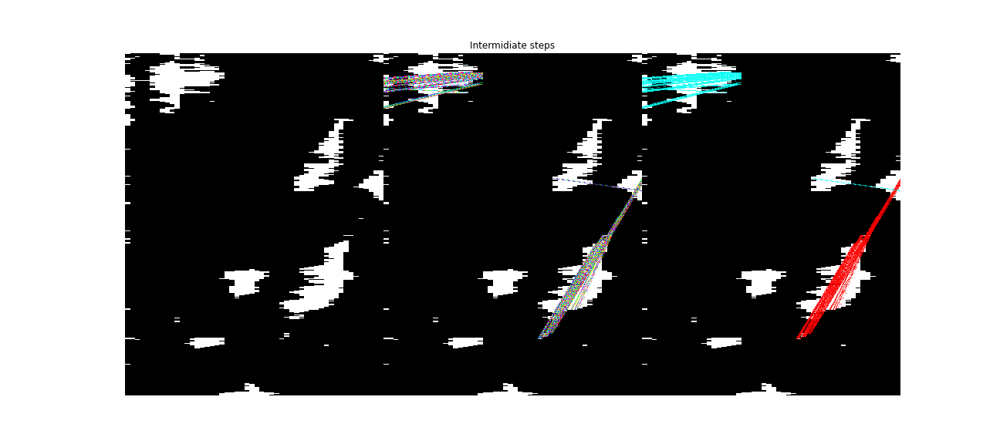
<p class="caption">plot of chunk unnamed-chunk-24</p>
</div><div class="figure">
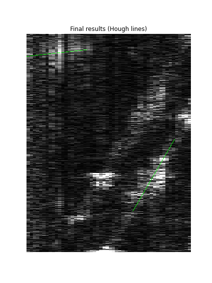
<p class="caption">plot of chunk unnamed-chunk-24</p>
</div><div class="figure">
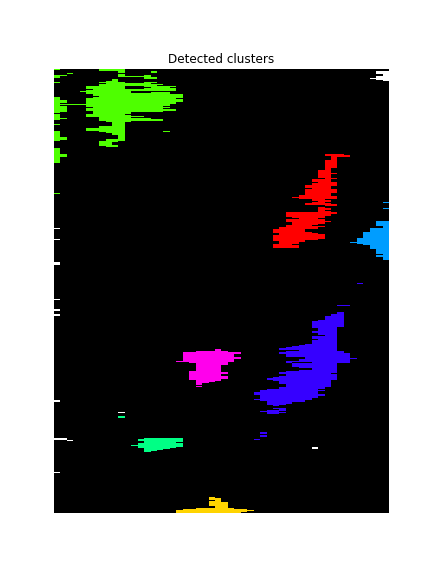
<p class="caption">plot of chunk unnamed-chunk-24</p>
</div><div class="figure">
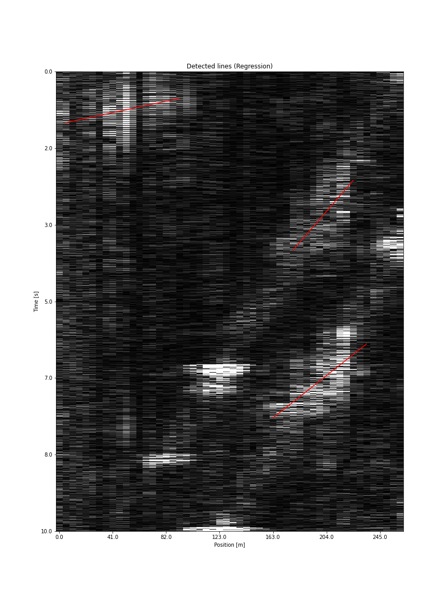
<p class="caption">plot of chunk unnamed-chunk-24</p>
</div><div class="figure">

<p class="caption">plot of chunk unnamed-chunk-24</p>
</div><div class="figure">
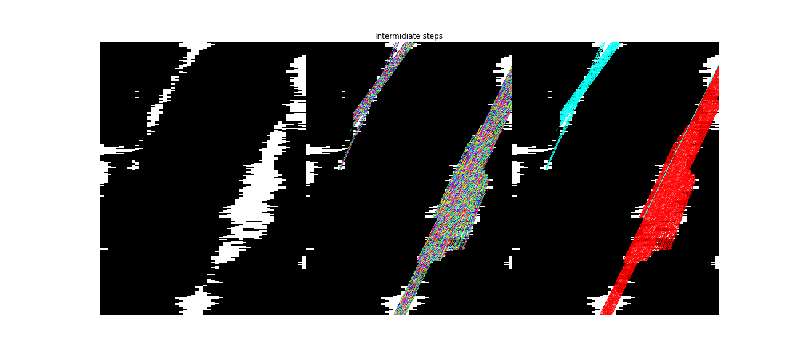
<p class="caption">plot of chunk unnamed-chunk-24</p>
</div><div class="figure">
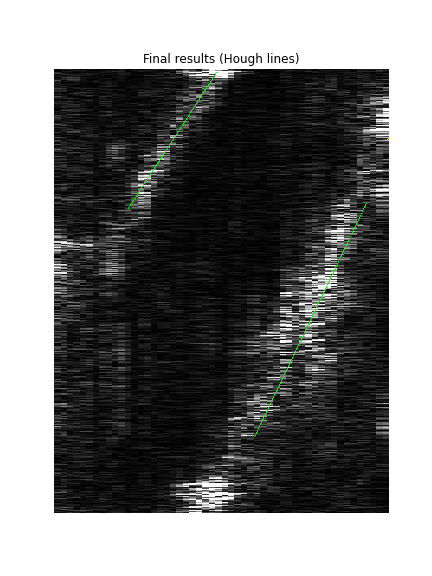
<p class="caption">plot of chunk unnamed-chunk-24</p>
</div><div class="figure">
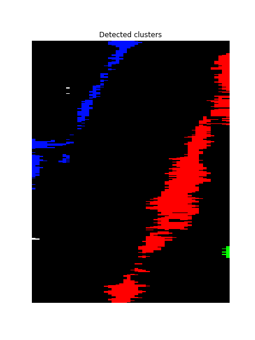
<p class="caption">plot of chunk unnamed-chunk-24</p>
</div><div class="figure">
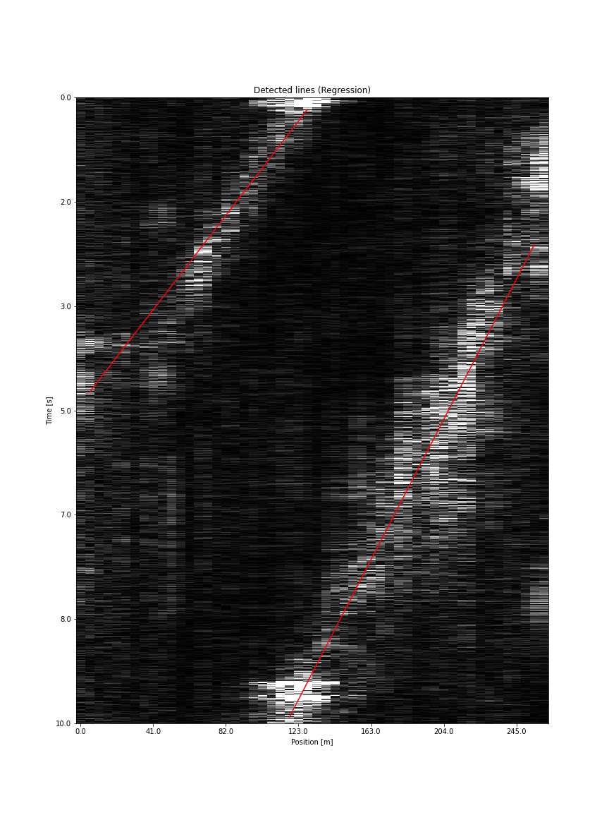
<p class="caption">plot of chunk unnamed-chunk-24</p>
</div><div class="figure">
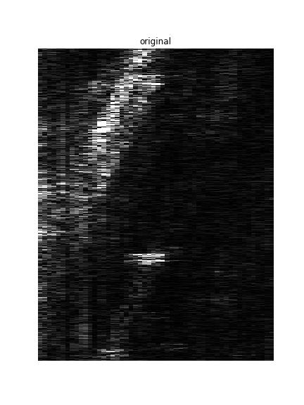
<p class="caption">plot of chunk unnamed-chunk-24</p>
</div><div class="figure">
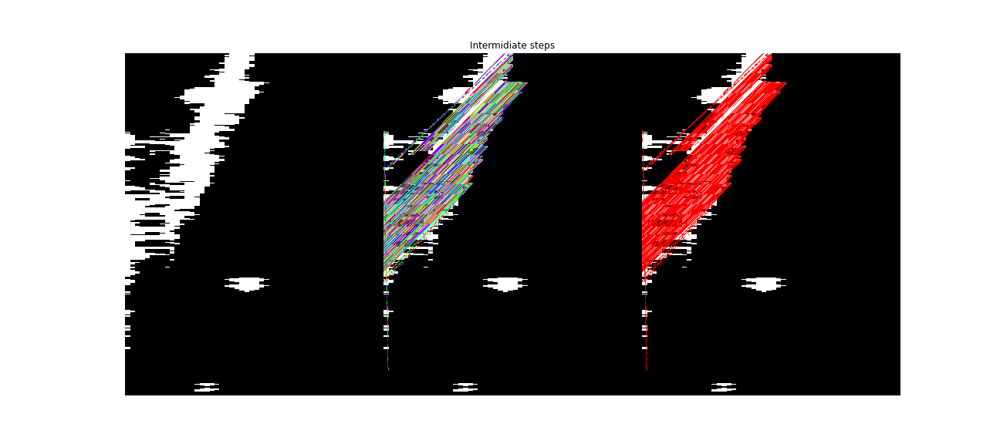
<p class="caption">plot of chunk unnamed-chunk-24</p>
</div><div class="figure">
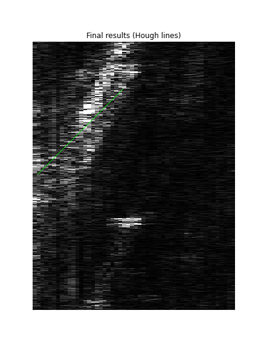
<p class="caption">plot of chunk unnamed-chunk-24</p>
</div><div class="figure">
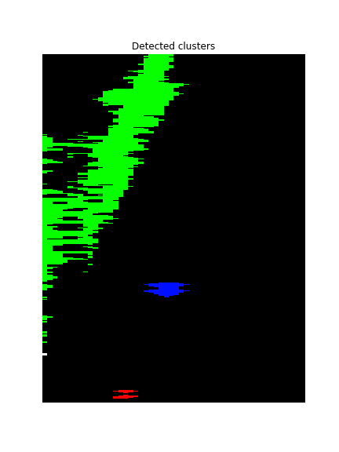
<p class="caption">plot of chunk unnamed-chunk-24</p>
</div><div class="figure">
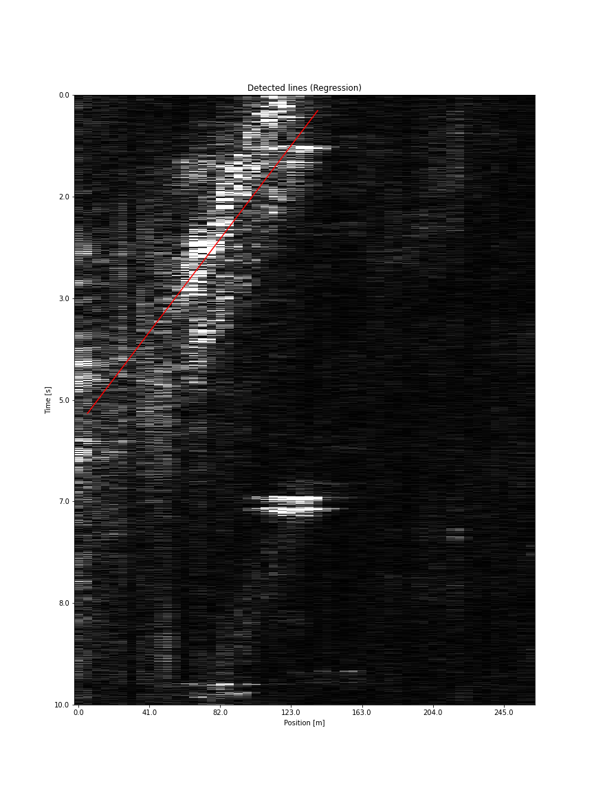
<p class="caption">plot of chunk unnamed-chunk-24</p>
</div><div class="figure">
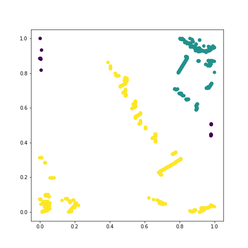
<p class="caption">plot of chunk unnamed-chunk-24</p>
</div>

